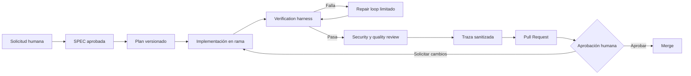

# Arquitectura del Agentic Engineering Harness

## Propósito

El harness de Aicon permite que un agente participe en ingeniería de software
sin sustituir el criterio del desarrollador. Su función es convertir una tarea
en evidencia revisable mediante reglas, planes, gates automáticos y aprobación
humana.

## Harness Engineering y Agentic Engineering

**Harness Engineering** es la infraestructura que hace repetible el trabajo:
comandos, pruebas, validación de migraciones, compilación y CI.

**Agentic Engineering** añade un actor capaz de inspeccionar, planificar,
implementar, analizar fallos y proponer correcciones. Esa capacidad exige
límites explícitos, trazabilidad y puntos de decisión humanos.

Aicon ya contaba con `check`, `verify`, `doctor`, pruebas Vitest, validación
PGlite y GitHub Actions. La capa agentic los coordina; no los reemplaza.

## Componentes

### Capa de especificación

Define problema, alcance, restricciones y resultados verificables. Las SPEC de
producto permanecen en `docs/specs/`; tareas técnicas pueden usar la plantilla
de `.agent/templates/` y enlazar la SPEC funcional que las origina.

### Capa de planificación

Los planes viven en `.agent/plans/` y declaran archivos previstos, riesgos,
pruebas, migraciones y pasos pequeños antes de modificar la aplicación.

### Capa de ejecución

El agente trabaja dentro de la arquitectura modular existente y en una rama de
tarea. El runtime de Aicon no depende del harness.

### Capa de verificación

`npm run verify` conserva el contrato principal. Las verificaciones adicionales
dependen del riesgo: cobertura para lógica, `db:lint` para base local alcanzable
y auditoría de dependencias para seguridad.

### Capa de trazabilidad

Una traza resumida enlaza tarea, plan, rama, commits, gates, reparaciones y
decisión humana. GitHub Actions conserva la evidencia remota de ejecución.

## Límites arquitectónicos

- El harness vive fuera de `src/` salvo adaptadores futuros estrictamente
  necesarios.
- No contiene reglas del negocio.
- No recibe credenciales como argumentos ni las registra.
- No despliega ni fusiona cambios automáticamente.
- No crea agentes múltiples si un único agente controlado es suficiente.
- No convierte fallos de infraestructura en aprobaciones falsas.

## Estado de automatización

| Control | Estado actual |
|---|---|
| Lint, tipos, pruebas, migraciones y build | Automatizado |
| Plan y traza | Plantilla, validación estructural y evidencia versionada |
| Repair loop | Máximo tres intentos controlado por el CLI; la reparación sigue a cargo del agente y la persona |
| Seguridad gradual | Entorno, patrones de secretos, artefactos y dependencias en `verify` y CI |
| Evidencia remota | Reporte JSON sanitizado conservado 14 días como artefacto de CI |
| Aprobación humana | Obligatoria; protección remota pendiente |
| Despliegue | Fuera de este incremento |

## Runner local

`scripts/agentic-harness.mjs` is an orchestration adapter outside the production
runtime. It validates task context and invokes `npm run verify` instead of
reimplementing its gates. It can optionally add the Supabase SQL lint.

Each explicit attempt creates an immutable JSON record. The runner stores
timestamps, branch, commit, command name, exit code and duration, but never
captures stdout, stderr or environment variables.

## Security and CI gate

`npm run security` validates the repository without importing application
runtime code. It checks high-confidence credential patterns, project-owned
environment references, agent artifacts and high-severity dependency findings.
CI uploads only its metadata report; diagnostic values remain absent.
