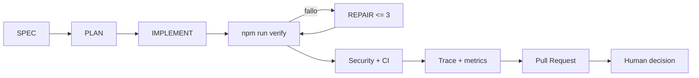

# Auditoría final del Agentic Engineering Harness

Fecha de corte: 2026-09-10.

## 1. Architecture summary

Aicon conserva un monolito modular con Next.js, TypeScript y Supabase. El
harness permanece fuera de `src/`: reglas en `AGENTS.md`, artefactos en
`.agent/`, ejecutores en `scripts/`, evidencia académica en `docs/` y gates
remotos en GitHub Actions. No existe dependencia del runtime de la aplicación
hacia el harness.



## 2. Harness Engineering assessment

El harness técnico es reproducible y proporcional al tamaño del proyecto:

- `check`: lint, TypeScript, Vitest, migraciones repetibles y estructura agentic.
- `build`: compilación de producción de Next.js.
- `security`: contrato de entorno, patrones de credenciales, artefactos y dependencias.
- `verify`: contrato compuesto que bloquea el cierre si falla un gate.
- GitHub Actions reproduce el contrato y conserva evidencia sanitizada 14 días.

Fortaleza principal: reutiliza comandos existentes y no creó una plataforma
paralela. Limitación principal: las pruebas completas de navegador y del entorno
administrado todavía no son automáticas.

## 3. Agentic Engineering assessment

El flujo `SPEC → PLAN → IMPLEMENT → VERIFY → REPAIR → REVIEW` ya es explícito,
versionado y ejecutable. El runner exige una rama, plan, identificador de tarea
y un intento entre 1 y 3. Cada intento genera evidencia JSON inmutable sin logs
ni valores de entorno.

AEH-002 aporta un caso empírico importante: los gates locales pasaron, SonarCloud
detectó dos problemas, se documentó la causa raíz, se aplicó una corrección
mínima y la segunda revisión remota pasó. Esto demuestra supervisión y reparación,
no autonomía ilimitada.

La aprobación humana continúa siendo necesaria para merge, producción, secretos,
datos destructivos y políticas críticas.

## 4. Security assessment

Controles existentes:

- sesiones y autorización en servidor;
- 21 tablas públicas con RLS y 38 políticas;
- validación Zod y restricciones SQL en entradas críticas;
- cabeceras defensivas y rutas privadas fuera de indexación;
- archivos de entorno ignorados y contrato mediante `.env.example`;
- escaneo de credenciales de alta confianza sin revelar coincidencias;
- `npm audit` para vulnerabilidades altas o críticas;
- permisos de CI limitados a `contents: read`.

El resultado reduce riesgo, pero no equivale a pentest, SAST exhaustivo ni
certificación OWASP. No se inspeccionan secretos de producción y no se deben
añadir a la evidencia.

## 5. Quality assessment

Los gates cubren reglas de dominio, aplicación, migraciones, RLS, contratos RPC,
herramientas agentic y build. El snapshot reproducible se encuentra en
`docs/agentic-engineering/evidence/agentic-metrics.json` y se regenera con:

```bash
npm run agent:metrics -- --output docs/agentic-engineering/evidence/agentic-metrics.json
```

Snapshot de cierre:

- 4 tareas gobernadas, 4 planes y 4 trazas.
- 3 tareas con SPEC formal; AEH-001 conserva su alcance aprobado legado.
- 3 tareas con evidencia automática y 5 intentos inmutables.
- 5 intentos aprobados y 0 intentos fallidos en la evidencia estructurada.
- 172.090 ms acumulados dentro de gates registrados.
- 21 archivos de prueba y 71 pruebas en el cierre de AEH-004.

La tasa de primer intento usa únicamente evidencia JSON del runner. No incluye
hallazgos remotos ni correcciones previas al intento; por ello no debe interpretarse
como tasa total de defectos. Las reparaciones cualitativas permanecen en cada
`summary.md`.

## 6. Remaining risks

- `main` no tiene protección obligatoria configurada.
- No hay recorridos E2E autenticados ni prueba completa con lector de pantalla.
- El escaneo de secretos es deliberadamente acotado.
- No existe evidencia de respaldo/restauración en preproducción.
- Correo, WhatsApp, alojamiento, dominio y monitoreo dependen de proveedores no aprobados.
- Persisten datos comerciales, fotografías y textos legales por confirmar.

Estos riesgos impiden declarar producción lista, pero están identificados y no
invalidan la evaluación académica del harness.

## 7. Technical debt

- AEH-001 nació de alcance aprobado antes de existir la plantilla formal de SPEC.
- La interpretación de causa raíz y reparaciones continúa siendo narrativa y humana.
- No existe umbral obligatorio de cobertura; se usa cobertura proporcional al riesgo.
- Las métricas no correlacionan automáticamente PR, CI y narrativas históricas.
- `docs/STATUS.md` debe mantenerse actualizado junto con futuras entregas.

## 8. Recommendations

Prioridad inmediata:

1. Revisar y fusionar AEH-004 mediante decisión humana.
2. Aprobar y activar protección de `main` con PR y checks obligatorios.
3. Presentar el TFM usando el caso de reparación AEH-002 y la evidencia reproducible.

Antes de producción:

1. Preparar un entorno administrado de preproducción.
2. Probar recorridos autenticados, accesibilidad manual y restauración de respaldo.
3. Completar contenido legal, inventario y configuración empresarial verificable.
4. Aprobar proveedores, monitoreo y responsables operativos.

## Veredicto

El objetivo académico se cumple cuando AEH-004 sea revisado: Aicon demuestra que
un agente puede trabajar de forma controlada, verificable, reproducible, segura
y auditable, mientras la persona conserva las decisiones irreversibles. El
producto es un MVP funcional; el lanzamiento público sigue condicionado por
evidencia operativa y decisiones externas.
