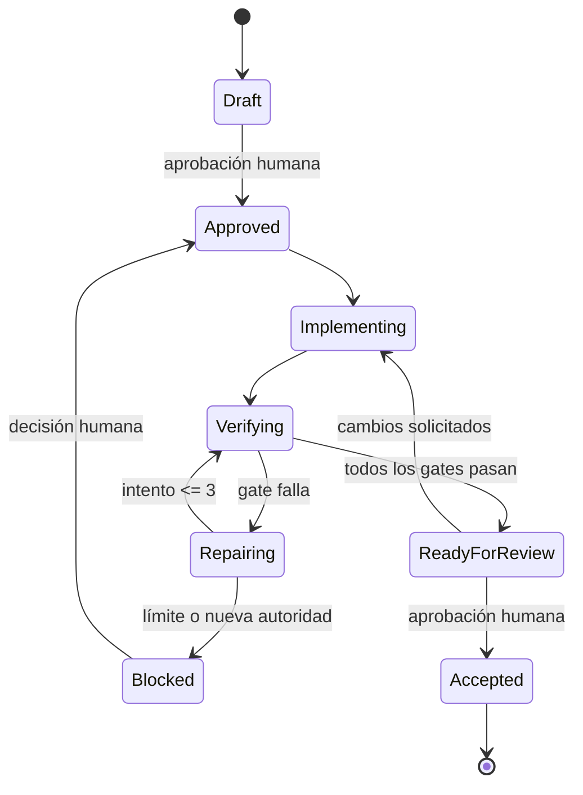

# Flujo SPEC → PLAN → IMPLEMENT → VERIFY → REPAIR → REVIEW

## 1. SPEC

La tarea debe enlazar una SPEC aprobada o crear una especificación técnica. Una
SPEC válida incluye problema, objetivo, alcance, fuera de alcance, requisitos,
criterios de aceptación, restricciones y estrategia de pruebas.

Una pregunta pendiente que pueda cambiar el resultado detiene la tarea. El
agente no la sustituye con una suposición de negocio.

## 2. PLAN

Antes de cambiar código se crea un plan en `.agent/plans/`. El plan identifica:

- archivos y componentes afectados;
- riesgos y mitigaciones;
- migraciones y efecto sobre RLS;
- pruebas y gates;
- recuperación o rollback seguro;
- nivel de autoridad y aprobación.

## 3. IMPLEMENT

La implementación usa una rama y cambios pequeños. Cada cambio debe poder
explicarse con relación a un criterio de aceptación. Las dependencias nuevas y
las ampliaciones de alcance requieren justificación.

## 4. VERIFY

Gate mínimo:

```bash
npm run verify
```

Una tarea controlada conserva evidencia mediante:

```bash
npm run agent:verify -- --task <TASK-ID> --attempt 1
```

El wrapper ejecuta el contrato principal y la auditoría de dependencias. La
opción `--db-lint` incorpora el lint SQL cuando la tarea afecta base de datos y
Supabase local está realmente disponible.

Gates condicionados:

```bash
npm run test:coverage  # lógica de dominio o aplicación
npm run db:lint        # cambios SQL con Supabase local alcanzable
npm audit --audit-level=high
```

Un gate bloqueado por el entorno no cuenta como aprobado.

## 5. REPAIR

Ante un fallo:

1. Conservar el comando y el error mínimo útil.
2. Formular una hipótesis de causa raíz.
3. Aplicar la corrección más pequeña.
4. Repetir el gate fallido y después el contrato completo.
5. Registrar el intento en la traza.

El límite es tres intentos por gate. Después se detiene el trabajo y se entrega
un informe de bloqueo. Operaciones destructivas y efectos externos nunca se
repiten automáticamente.

Los archivos `verification-attempt-1.json` a
`verification-attempt-3.json` son inmutables. El agente realiza el diagnóstico
y la reparación; el CLI controla el límite y registra únicamente el resultado.

## 6. REVIEW

Antes del Pull Request se comprueba:

- diff limitado al alcance;
- SPEC, plan y traza enlazados;
- gates y seguridad documentados;
- riesgos restantes visibles;
- ausencia de secretos y datos personales.

CI confirma reproducibilidad técnica. Una persona conserva la decisión de
aceptar, pedir cambios, fusionar o desplegar.

## Estados de una tarea



## Definition of Done

Una tarea está lista para revisión cuando satisface su SPEC, respeta la
arquitectura, tiene pruebas proporcionales, supera los gates aplicables,
actualiza documentación y traza, no mantiene vulnerabilidades críticas
conocidas y presenta un Pull Request revisable.
