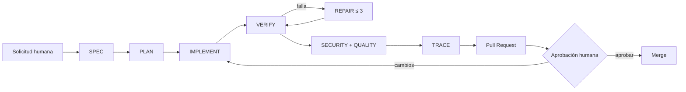

# AICON: diseño y evaluación de un Agentic Engineering Harness para ingeniería de software controlada

> **Estado:** borrador académico listo para adaptación institucional y revisión del tutor.  
> **Autor:** `[PENDIENTE: nombre completo]`  
> **Programa:** `[PENDIENTE: nombre oficial del máster]`  
> **Universidad:** `[PENDIENTE: institución]`  
> **Tutor/a:** `[PENDIENTE: nombre]`  
> **Convocatoria:** `[PENDIENTE: mes y año]`

## Nota de uso

Este documento consolida el argumento académico del proyecto. Las especificaciones,
planes, trazas, métricas y decisiones arquitectónicas enlazadas son fuentes
versionadas y forman parte de la evidencia. Antes de entregar, debe aplicarse la
plantilla institucional y completarse la [checklist de entrega](checklist-entrega.md).

## Resumen

La incorporación de modelos de lenguaje en tareas de ingeniería de software
permite acelerar actividades de inspección, implementación y verificación, pero
también introduce riesgos de cambios fuera de alcance, conclusiones no respaldadas,
exposición de secretos y autonomía excesiva. Este Trabajo Final de Máster diseña,
implementa y evalúa un **Agentic Engineering Harness** dentro de AICON, una
aplicación web inmobiliaria construida con Next.js, TypeScript y Supabase.

El artefacto propone un proceso explícito
`SPEC → PLAN → IMPLEMENT → VERIFY → REPAIR → REVIEW`, con especificaciones y
planes versionados, gates reproducibles, un ciclo de reparación limitado a tres
intentos, evidencia sanitizada y aprobación humana para acciones críticas. La
solución reutiliza el harness técnico previo del proyecto —lint, comprobación de
tipos, pruebas, migraciones, build y CI— en lugar de sustituirlo por una plataforma
paralela.

La evaluación adopta un estudio de caso basado en cuatro incrementos de gobierno
agentic. En el corte de evidencia se registraron cuatro tareas, cuatro planes,
cuatro trazas, cinco intentos verificables y 172.090 ms acumulados en gates. El
estado final ejecutó 71 pruebas en 21 archivos, validó 21 tablas con Row Level
Security y 38 políticas, compiló la aplicación y no detectó vulnerabilidades
conocidas de severidad alta o crítica. SonarCloud identificó problemas no
detectados localmente en dos incrementos, lo que permitió observar reparaciones
mínimas y demostrar que una validación local aprobada no sustituye la revisión
remota ni humana.

Los resultados indican que el harness mejora la trazabilidad, reproducibilidad y
capacidad de revisión de la participación del agente. No demuestran ausencia de
defectos ni preparación productiva. La principal contribución es una arquitectura
ligera que aumenta la capacidad del desarrollador manteniendo límites técnicos y
decisiones irreversibles bajo control humano.

**Palabras clave:** ingeniería de software agentic, modelos de lenguaje,
trazabilidad, integración continua, seguridad, human-in-the-loop, quality gates.

## Abstract

The use of large language models in software engineering can accelerate repository
inspection, implementation and verification. It can also introduce out-of-scope
changes, unsupported conclusions, secret exposure and excessive autonomy. This
Master's thesis designs, implements and evaluates an **Agentic Engineering
Harness** within AICON, a real-estate web application built with Next.js,
TypeScript and Supabase.

The artifact defines an explicit
`SPEC → PLAN → IMPLEMENT → VERIFY → REPAIR → REVIEW` process supported by
versioned specifications and plans, reproducible quality gates, a repair loop
limited to three attempts, sanitized evidence and human approval for critical
actions. It reuses the project's existing technical harness —linting, type
checking, tests, repeatable migrations, production build and continuous
integration— instead of replacing it with a parallel platform.

The evaluation follows a case-study approach across four agent-governance
increments. At the evidence cut-off, the repository contained four governed
tasks, four plans, four traces, five machine-readable attempts and 172,090 ms of
recorded gate execution. The final state ran 71 tests in 21 files, validated 21
tables protected by Row Level Security and 38 policies, completed a production
build and reported no known high or critical dependency vulnerabilities.
SonarCloud found issues that local gates had not detected in two increments,
providing observable repair cases and showing that successful local verification
does not replace remote or human review.

The results suggest that the harness improves traceability, reproducibility and
reviewability of agent-assisted work. They do not establish defect absence or
production readiness. The main contribution is a lightweight architecture that
increases developer capacity while keeping irreversible decisions under human
control.

**Keywords:** agentic software engineering, large language models, traceability,
continuous integration, security, human-in-the-loop, quality gates.

---

# 1. Introducción

## 1.1 Contexto

Los modelos de lenguaje han evolucionado desde asistentes que generan fragmentos
de código hacia agentes capaces de inspeccionar repositorios, usar herramientas,
modificar archivos y reaccionar ante resultados de pruebas. Trabajos como ReAct
formalizan la combinación entre razonamiento y actuación [1], mientras que
Reflexion estudia ciclos de mejora apoyados en retroalimentación verbal y memoria
de intentos [2]. En ingeniería de software, SWE-bench muestra tanto el potencial
como la dificultad de resolver incidencias reales a escala de repositorio [3].

Estas capacidades no eliminan los controles tradicionales. Un parche plausible
puede violar una decisión arquitectónica, debilitar autorización o superar pruebas
insuficientes. La cuestión relevante no es únicamente cuánto código puede producir
un agente, sino bajo qué reglas trabaja, qué evidencia deja y quién conserva la
autoridad sobre acciones irreversibles.

AICON ofrece un contexto adecuado para estudiar el problema. Es un producto
funcional con catálogo inmobiliario, CRM, cotizaciones y agenda; además, ya poseía
un harness técnico con pruebas, validación de migraciones, compilación e integración
continua. El trabajo no parte de una aplicación vacía: estudia cómo evolucionarla
sin reconstruir componentes sanos ni convertir el gobierno agentic en una nueva
dependencia del producto.

## 1.2 Problema

El flujo inicial podía representarse como:

```text
desarrollador → código → npm run check → build → CI
```

Este flujo verificaba el resultado técnico, pero no hacía explícitos el alcance
aprobado, el plan previo, los límites de autoridad del agente, los intentos de
reparación ni la evidencia necesaria para revisar cómo se obtuvo el cambio. La
ausencia de esta capa dificulta responder preguntas esenciales:

- ¿Qué requisito autorizó la modificación?
- ¿Qué archivos y riesgos se anticiparon antes de implementar?
- ¿Qué gates se ejecutaron y con qué resultado?
- ¿Cuántas reparaciones se intentaron y por qué?
- ¿Qué información se excluyó de las trazas por seguridad?
- ¿Qué decisión continuó reservada a una persona?

## 1.3 Pregunta de investigación

> ¿Puede un agente de IA aumentar la capacidad de un desarrollador dentro de un
> proceso controlado, verificable, reproducible, seguro y auditable sin sustituir
> la aprobación humana?

## 1.4 Objetivo general

Diseñar, implementar y evaluar un Agentic Engineering Harness ligero para AICON
que gobierne la participación de agentes de IA mediante especificaciones, planes,
verificación automatizada, reparación limitada, seguridad gradual, trazabilidad y
aprobación humana.

## 1.5 Objetivos específicos

1. Analizar el harness técnico existente y sus brechas de gobierno agentic.
2. Definir una arquitectura que reutilice los controles actuales del repositorio.
3. Estandarizar SPEC, planes, trazas y Definition of Done.
4. Crear un runner que produzca evidencia inmutable y limite las reparaciones.
5. Incorporar gates de seguridad proporcionales al riesgo del proyecto.
6. Integrar el proceso con GitHub Actions y Pull Requests.
7. Evaluar reproducibilidad, trazabilidad, resultados y limitaciones del artefacto.

## 1.6 Contribuciones

- Una definición operacional de Harness Engineering y Agentic Engineering aplicada
  a un proyecto real.
- Un flujo ejecutable que conecta especificación, implementación y decisión humana.
- Un runner pequeño, independiente del runtime, que conserva evidencia sanitizada.
- Un modelo de autoridad con acciones SAFE, CONTROLLED y REQUIRE APPROVAL.
- Un caso empírico de reparación local/remota con límites explícitos.
- Un paquete reproducible de métricas, auditoría y demostración académica.

## 1.7 Alcance

El objeto principal de estudio es el proceso de ingeniería asistida, no la eficacia
comercial del producto inmobiliario. El trabajo no pretende demostrar autonomía
general, comparar exhaustivamente modelos, certificar seguridad ni declarar AICON
listo para producción. Tampoco incorpora microservicios o múltiples agentes para
aumentar artificialmente la complejidad.

# 2. Fundamentos y trabajos relacionados

## 2.1 Harness Engineering

En este trabajo, **Harness Engineering** se define operacionalmente como el
conjunto de comandos, pruebas, validaciones, entornos y pipelines que hacen
repetible la construcción y evaluación del software. No se presenta como un
estándar académico independiente, sino como una categoría práctica que agrupa
controles conocidos de integración y entrega continua [9].

En AICON incluye ESLint, TypeScript estricto, Vitest, validación repetible de
migraciones, build de Next.js, auditoría de dependencias y GitHub Actions. Su
propósito es convertir expectativas de calidad en resultados observables.

## 2.2 Agentic Engineering

**Agentic Engineering** añade al harness un actor que puede inspeccionar, planificar,
implementar, ejecutar herramientas y proponer reparaciones. ReAct muestra la utilidad
de intercalar razonamiento y acciones en entornos externos [1]. Reflexion evidencia
que la retroalimentación de intentos anteriores puede orientar una nueva actuación
sin modificar los pesos del modelo [2].

Sin embargo, una arquitectura de agente para ingeniería necesita más que un bucle
de herramientas. Debe limitar alcance, intentos y autoridad; separar evidencias de
secretos; y terminar en una decisión revisable. SWE-bench utiliza pruebas del
repositorio como señal objetiva para evaluar cambios [3], pero aprobar pruebas no
garantiza seguridad, mantenibilidad ni correspondencia completa con la intención.

## 2.3 Calidad de software y gates

ISO/IEC 25010:2023 describe un modelo de calidad de producto que incluye
características como adecuación funcional, eficiencia, compatibilidad, interacción,
fiabilidad, seguridad, mantenibilidad, flexibilidad y seguridad operacional [4].
El harness no pretende medir exhaustivamente cada característica. Traduce una
selección proporcional al proyecto en gates verificables:

| Dimensión | Evidencia en AICON |
|---|---|
| Adecuación funcional | Pruebas de dominio, aplicación y contratos |
| Fiabilidad | Migraciones repetibles y build de producción |
| Seguridad | RLS, validación, auditoría de dependencias y secretos |
| Mantenibilidad | ESLint, TypeScript, arquitectura y SonarCloud |
| Reproducibilidad | Comandos npm compartidos entre local y CI |

Un gate expresa una condición necesaria para avanzar, no una garantía absoluta.
La ausencia de fallos detectados debe interpretarse dentro del alcance de los
controles ejecutados.

## 2.4 Desarrollo seguro

NIST SSDF organiza prácticas de desarrollo seguro en preparación de la
organización, protección del software, producción de software seguro y respuesta
a vulnerabilidades [5]. OWASP Top 10 aporta categorías aplicables a aplicaciones
web, entre ellas control de acceso roto, inyección, configuración insegura,
componentes vulnerables y fallos de autenticación [6].

AICON utiliza estos marcos como referencias de riesgo, no como afirmación de
conformidad o certificación. La capa implementada revisa secretos, variables de
entorno, dependencias, entradas, autenticación, autorización, RLS y exposición de
evidencia. Un pentest y un SAST especializado permanecen fuera del alcance.

## 2.5 Supervisión humana

El NIST AI Risk Management Framework propone gobernar, mapear, medir y gestionar
riesgos de sistemas de IA [7]. En el harness, la supervisión humana no es un paso
simbólico: determinadas acciones no pueden ejecutarse por inferencia del agente.
Merge, producción, secretos, cambios destructivos y debilitamiento de controles
requieren autorización explícita.

## 2.6 Metodología de construcción del artefacto

El trabajo se aproxima a Design Science Research: identifica un problema práctico,
construye un artefacto, lo demuestra en contexto y evalúa su utilidad y límites [8].
No se busca una teoría universal sobre agentes, sino una solución justificable y
reproducible para un caso delimitado.

# 3. Contexto y estado inicial de AICON

## 3.1 Producto

AICON es un monolito modular para una empresa inmobiliaria de Costa Rica. Integra
una experiencia pública, administración de condominios, modelos y unidades,
fotografías, cotizaciones, contacto, CRM y citas. Los módulos separan, cuando aporta
valor, dominio, aplicación, infraestructura e interfaz.

## 3.2 Arquitectura técnica

- Next.js 16 y React 19 para rutas públicas y panel.
- TypeScript estricto y Zod para contratos y entradas.
- Supabase para PostgreSQL, autenticación y almacenamiento.
- Vitest para pruebas y PGlite para validar migraciones en bases limpias.
- GitHub Actions y SonarCloud para revisión remota.

La dirección general de dependencias es:

```text
interfaz / infraestructura → aplicación → dominio
```

## 3.3 Harness inicial

Antes de la capa agentic existían:

- `npm run lint`;
- `npm run typecheck`;
- `npm run test`;
- `npm run db:test`;
- `npm run build`;
- `npm run check` y `npm run verify`;
- diagnóstico de entorno local;
- CI sobre pushes y Pull Requests.

La fortaleza era una base técnica reproducible. Las brechas eran de gobierno:
no había formato obligatorio de tarea, plan versionado, niveles de autoridad,
límite de reparación ni traza enlazada con la decisión humana.

# 4. Metodología

## 4.1 Diseño de investigación

Se adopta un estudio de caso único e instrumental. AICON funciona como entorno
real para diseñar y observar el harness. La unidad de análisis es una tarea
agentic completa:

```text
SPEC + PLAN + DIFF + GATES + TRACE + PR + DECISIÓN HUMANA
```

## 4.2 Fases

1. **Repository Assessment:** inventario de arquitectura, herramientas y brechas.
2. **Target Architecture:** definición del flujo, autoridad y evidencias.
3. **Gap Analysis:** correspondencia entre estado actual, objetivo y acción.
4. **Implementation Plan:** incrementos pequeños y verificables.
5. **Implementation:** ejecución por rama con gates después de cada incremento.
6. **Final Audit:** evaluación técnica, de seguridad, calidad y limitaciones.

## 4.3 Incrementos observados

| Tarea | Propósito | Resultado principal |
|---|---|---|
| AEH-001 | Gobierno agentic | Reglas, plantillas, autoridad y ADR |
| AEH-002 | Runner y repair loop | Evidencia JSON inmutable y máximo de 3 intentos |
| AEH-003 | Seguridad y CI | Gates graduales y reporte sanitizado |
| AEH-004 | Auditoría y métricas | Snapshot reproducible y paquete académico |

## 4.4 Instrumentación

El runner registra únicamente metadatos: identificador, intento, rama, commit,
comando, estado, duración y siguiente acción. No conserva stdout, stderr, prompts,
valores de entorno ni datos de formularios. Las métricas se calculan desde
artefactos estructurados bajo `.agent/`.

## 4.5 Criterios de evaluación

- Reproducibilidad de los gates.
- Correspondencia entre SPEC, plan y cambio.
- Visibilidad de fallos y reparaciones.
- Cumplimiento de límites de autoridad.
- Ausencia de información sensible en la evidencia.
- Capacidad de una persona para decidir a partir del PR.

# 5. Arquitectura propuesta

## 5.1 Flujo principal



## 5.2 Capas

### Especificación

Define problema, objetivo, alcance, exclusiones, requisitos, restricciones y
criterios de aceptación. Reduce la posibilidad de que el agente amplíe el trabajo
para resolver un fallo o interprete una petición vaga como permiso ilimitado.

### Planificación

Enumera archivos, componentes, riesgos, pruebas, migraciones y recuperación antes
de modificar el repositorio. El plan es una hipótesis revisable, no una autorización
para ejecutar acciones fuera del nivel asignado.

### Implementación

Se realizan incrementos pequeños sobre una rama. La arquitectura de la aplicación
continúa siendo la fuente de restricciones; el harness permanece fuera de `src/`.

### Verificación y reparación

`npm run verify` compone los gates existentes. Si falla, el agente identifica una
causa raíz, aplica una corrección mínima y repite. Después de tres intentos fallidos
debe detenerse y producir un informe; nunca repite automáticamente operaciones
destructivas.

### Seguridad y trazabilidad

El security harness comprueba contratos de entorno, patrones de credenciales,
artefactos y dependencias. Las trazas registran resultados resumidos. La evidencia
de CI se conserva temporalmente y excluye valores y logs sensibles.

### Decisión humana

Un CI verde permite revisar; no autoriza merge ni producción. Este límite distingue
automatización asistida de autonomía sin supervisión.

## 5.3 Niveles de autoridad

| Nivel | Ejemplos | Regla |
|---|---|---|
| SAFE | Leer, planificar, ejecutar tests | Permitido sin aprobación adicional |
| CONTROLLED | Código, documentación, migración no destructiva | Requiere SPEC y plan aprobados |
| REQUIRE APPROVAL | Merge, producción, secretos, datos destructivos | Confirmación humana inmediata antes de actuar |

## 5.4 Decisiones arquitectónicas

Las decisiones se justifican en cinco ADR:

1. Harness ligero dentro del repositorio.
2. Reutilización de `npm run verify` como gate principal.
3. Aprobación humana según nivel de autoridad.
4. Runner local con evidencia sanitizada e intentos explícitos.
5. Gates de seguridad y evidencia sanitizada en CI.

# 6. Implementación

## 6.1 Fuente de verdad para agentes

`AGENTS.md` reúne arquitectura, convenciones, seguridad, base de datos, Git,
prohibiciones y Definition of Done. Archivos específicos, como `CLAUDE.md`, lo
referencian en lugar de copiar reglas. Esta decisión reduce divergencia entre
agentes.

## 6.2 Artefactos versionados

`.agent/specs/`, `.agent/plans/` y `.agent/runs/` contienen artefactos legibles
sin herramientas propietarias. Un mismo identificador enlaza el alcance con su
plan, intentos, resumen y PR.

## 6.3 Runner agentic

El runner valida que:

- la tarea y el plan existen;
- el trabajo ocurre en una rama;
- el intento está entre 1 y 3;
- el archivo de evidencia no existe previamente;
- los gates concluyen antes de emitir un resultado.

Cada intento produce JSON inmutable. La salida diagnóstica permanece en terminal
y no se copia a la evidencia.

## 6.4 Verification harness

```text
verify
├── check
│   ├── lint
│   ├── typecheck
│   ├── test
│   ├── db:test
│   └── agent:artifacts
├── build
└── security
```

El diseño conserva un único contrato local y remoto. Las comprobaciones específicas
—cobertura o `db:lint`— se añaden según el riesgo, no como complejidad permanente.

## 6.5 Security harness

La implementación revisa:

- variables requeridas y archivos de entorno ignorados;
- patrones de credenciales de alta confianza;
- integridad mínima de SPEC, planes y trazas;
- vulnerabilidades de dependencias altas o críticas;
- permisos mínimos del workflow;
- reporte sanitizado como artefacto temporal de CI.

No inspecciona claves de producción ni sustituye herramientas especializadas.

## 6.6 Métricas

`npm run agent:metrics` agrega metadatos desde planes, SPEC y archivos de intento.
El algoritmo ignora texto libre, prompts, logs y valores de entorno. El snapshot
versionado permite reproducir el corte utilizado en esta memoria.

# 7. Evaluación y resultados

## 7.1 Resultados cuantitativos

El snapshot del cierre de AEH-004 contiene:

| Métrica | Resultado |
|---|---:|
| Tareas gobernadas | 4 |
| SPEC formales | 3 |
| Planes | 4 |
| Trazas | 4 |
| Tareas con evidencia automática | 3 |
| Intentos inmutables | 5 |
| Intentos aprobados | 5 |
| Intentos fallidos registrados | 0 |
| Aprobación en primer intento estructurado | 100 % |
| Duración acumulada de gates | 172.090 ms |

En la verificación final del incremento se observaron:

- 21 archivos de prueba y 71 pruebas aprobadas;
- 21 tablas públicas con RLS;
- 38 políticas de acceso;
- build de producción aprobado;
- 237 archivos revisados por el harness de seguridad;
- 0 vulnerabilidades conocidas de severidad alta o crítica.

## 7.2 Interpretación de las métricas

La tasa del 100 % corresponde únicamente al primer intento **estructurado por el
runner** para tareas que poseen ese tipo de evidencia. No mide todos los defectos
ni incluye hallazgos remotos posteriores. AEH-001 es anterior a la plantilla formal
de SPEC y se conserva explícitamente como dato legado.

Por tanto, estas cifras demuestran capacidad de reproducción y trazabilidad, no
superioridad general del agente ni ausencia de errores.

## 7.3 Evidencia cualitativa: repair loop

AEH-002 y AEH-004 aportan evidencia especialmente relevante. Los gates locales
aprobaron, pero SonarCloud señaló problemas de mantenibilidad o fiabilidad. El
proceso no ocultó los hallazgos: documentó la causa, aplicó correcciones pequeñas,
repitió la verificación y esperó un nuevo resultado remoto.

El caso de AEH-004 detectó un `Array.sort()` sin comparador explícito. La reparación
añadió un comparador reutilizable con `localeCompare`, ejecutó de nuevo las pruebas
y registró un segundo intento. Esta secuencia ilustra que:

1. la validación local y remota son complementarias;
2. reparar no exige ampliar el alcance;
3. la traza permite explicar por qué cambió el código;
4. el merge continuó reservado a aprobación humana.

## 7.4 Correspondencia con los objetivos

| Objetivo | Evidencia | Evaluación |
|---|---|---|
| Gobierno explícito | AGENTS, SPEC, planes y ADR | Cumplido |
| Verificación reproducible | `verify`, runner y CI | Cumplido |
| Reparación limitada | máximo 3 intentos y trazas | Cumplido |
| Seguridad gradual | security harness y reporte | Cumplido dentro del alcance |
| Trazabilidad | IDs, JSON, resúmenes y PR | Cumplido |
| Control humano | niveles de autoridad y merges aprobados | Cumplido |

# 8. Seguridad, privacidad y ética

## 8.1 Protección de información

El diseño aplica minimización de datos: guarda resultados y metadatos suficientes
para auditoría, pero excluye secretos, prompts, stdout, stderr, variables de entorno
y datos de clientes. Un artefacto académico no justifica copiar información que no
sea necesaria para evaluar el proceso.

## 8.2 Seguridad de aplicación

AICON valida permisos en servidor y en PostgreSQL mediante RLS. El navegador solo
usa claves públicas; operaciones sensibles se validan nuevamente en límites
críticos. Estos controles reducen riesgos de acceso roto e inyección señalados por
OWASP [6], aunque no prueban conformidad total.

## 8.3 Riesgos del agente

- **Alucinación:** mitigada mediante SPEC, evidencia y prohibición de inventar datos.
- **Expansión de alcance:** mitigada con plan aprobado y reparación mínima.
- **Autonomía excesiva:** mitigada por niveles de autoridad.
- **Exposición de secretos:** mitigada por trazas sanitizadas y reglas explícitas.
- **Confianza indebida en tests:** mitigada por revisión remota y humana.

## 8.4 Responsabilidad

El desarrollador conserva responsabilidad sobre alcance, aceptación y acciones
irreversibles. El agente produce trabajo y evidencia; no se presenta como autor
moral ni como sustituto del juicio profesional.

# 9. Discusión

## 9.1 Respuesta a la pregunta de investigación

En el contexto observado, sí es posible aumentar la capacidad del desarrollador
sin eliminar el control humano. El resultado depende menos de conceder más
autonomía y más de proporcionar restricciones verificables, herramientas estables
y puntos explícitos de decisión.

El harness convirtió instrucciones conversacionales en artefactos versionados,
reutilizó gates existentes y permitió explicar reparaciones. A la vez, detuvo el
merge hasta recibir aprobación. Esta combinación responde a la pregunta dentro
del caso AICON.

## 9.2 Beneficios observados

- Mayor claridad de alcance antes de modificar.
- Menor dependencia de memoria conversacional.
- Reproducción local y remota del mismo contrato.
- Evidencia adecuada para revisión técnica y académica.
- Mejor separación entre automatización y autoridad.
- Coste arquitectónico bajo al permanecer fuera del runtime.

## 9.3 Costes y compromisos

- Escribir SPEC, planes y trazas añade tiempo.
- La evidencia puede quedar desactualizada si no forma parte del Definition of Done.
- Los gates consumen recursos y no cubren todos los riesgos.
- La interpretación de causa raíz sigue dependiendo del criterio humano.
- Un proceso demasiado rígido sería desproporcionado para cambios triviales.

## 9.4 Amenazas a la validez

### Validez interna

El mismo entorno participó en construcción y evaluación. Una revisión independiente
podría identificar sesgos o inconsistencias. Los fallos de Docker o red pueden
afectar tiempos sin relacionarse con el código.

### Validez externa

Es un proyecto y un equipo pequeños. Los resultados no pueden generalizarse sin
estudios adicionales a repositorios, lenguajes, equipos y modelos distintos.

### Validez de constructo

Gates aprobados no equivalen a calidad total. El tiempo registrado representa
ejecución de comandos, no esfuerzo humano completo. La métrica de primer intento
excluye hallazgos remotos.

### Validez de conclusión

Cinco intentos son insuficientes para inferencia estadística. La evaluación es
descriptiva y de utilidad del artefacto, no un experimento comparativo causal.

# 10. Conclusiones

Este trabajo transformó el harness técnico de AICON en un Agentic Engineering
Harness explícito, reproducible y auditable. La solución no reemplaza las prácticas
de ingeniería existentes; las organiza alrededor de una tarea gobernada desde la
SPEC hasta la decisión humana.

La evidencia muestra que el agente pudo inspeccionar, planificar, implementar,
verificar y reparar cambios dentro de límites definidos. Los hallazgos remotos de
SonarCloud demostraron el valor de combinar herramientas y evitar que un resultado
local se interprete como verdad absoluta. Las trazas sanitizadas permitieron
conservar evidencia sin almacenar información sensible.

La contribución central no es un agente más autónomo, sino un entorno que hace su
trabajo más revisable. En AICON, la capacidad aumentó porque el repositorio impuso
reglas, gates y autoridad humana. Esta conclusión es coherente con el objetivo del
TFM: demostrar participación agentic controlada, no sustitución del desarrollador.

## 10.1 Limitaciones

- No hay protección obligatoria de `main` documentada como activada.
- No existen recorridos E2E autenticados completos ni prueba con lector de pantalla.
- El escaneo de secretos y seguridad es deliberadamente acotado.
- No se ha probado respaldo y restauración en preproducción.
- La muestra de tareas es pequeña y pertenece a un único repositorio.
- AICON aún depende de datos reales y proveedores para producción.

## 10.2 Trabajo futuro

1. Evaluar el harness con más tareas y categorías de riesgo.
2. Añadir correlación automatizada entre intentos, PR y resultados remotos.
3. Incorporar E2E autenticado y accesibilidad manual documentada.
4. Evaluar SAST y secret scanning especializado según coste y evidencia.
5. Comparar modelos o configuraciones con el mismo protocolo experimental.
6. Probar el proceso con revisores independientes y equipos mayores.
7. Preparar preproducción, respaldo, monitoreo y proveedores antes del lanzamiento.

# 11. Reproducibilidad

El repositorio contiene instrucciones de arranque y versiones fijadas. La
verificación académica mínima es:

```bash
npm ci
npm run verify
npm run agent:metrics -- --output docs/agentic-engineering/evidence/agentic-metrics.json
```

La ejecución exige Node 22 y npm 10. Las migraciones se prueban en dos bases
efímeras; la interacción con datos reales requiere Supabase configurado. La
evidencia de este documento se localiza mediante el [mapa de anexos](anexos.md).

# Referencias

La bibliografía completa y los enlaces verificados se encuentran en
[referencias.md](referencias.md). Las citas `[1]` a `[9]` de esta memoria siguen
ese orden.

# Anexos

El índice razonado de especificaciones, planes, trazas, ADR, métricas y comandos
se encuentra en [anexos.md](anexos.md).
